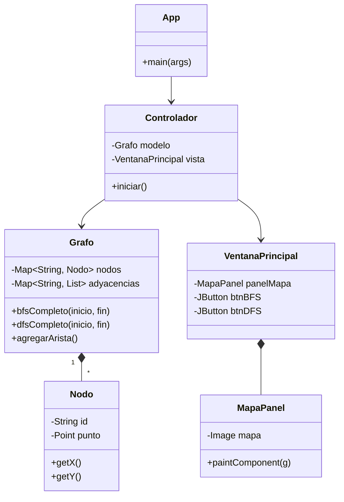
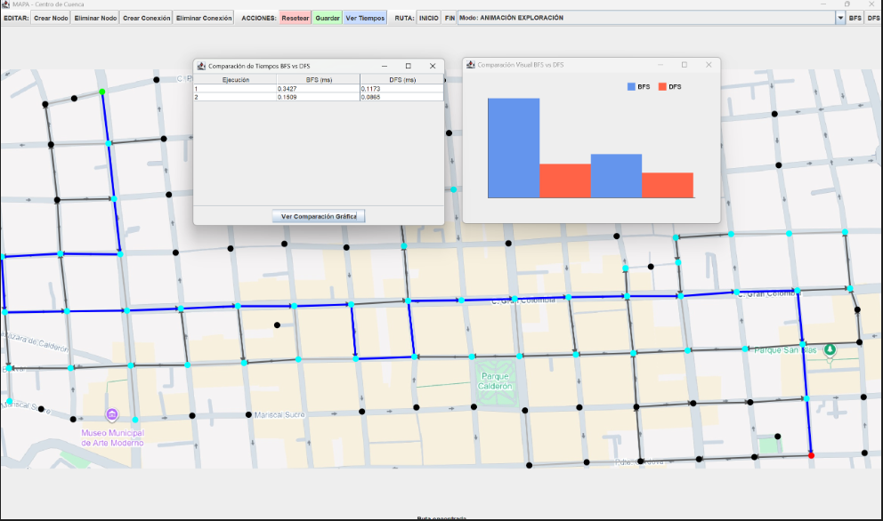

# Informe Técnico: Sistema de Navegación y Análisis de Grafos (BFS vs DFS)

<div align="center">
    
    <h3>Universidad Politécnica Salesiana</h3>
    <h4>Carrera de Ingeniería en Ciencias de la Computación</h4>
    <h4>Asignatura: Estructura de Datos</h4>
</div>

---

## 1. Integrantes del Proyecto

| Estudiantes | Correo Institucional |
|-----------------------|----------------------|
| Javier Barrezueta |  jbarrezuetao@est.ups.edu.ec |
| Sebastian Yupangui | dyupanguib@est.ups.edu.ec |


---

## 2. Descripción del Problema

El problema abordado consiste en la simulación y análisis de rutas dentro de un entorno urbano, específicamente en el sector del Centro de Cuenca. La necesidad principal es comprender cómo los algoritmos de búsqueda computacional pueden resolver problemas de navegación en la vida real.

El proyecto busca modelar un mapa estático como un **Grafo Dirigido**, donde las intersecciones funcionan como nodos y las calles como aristas. El objetivo es desarrollar una herramienta visual que permita crear dicha topología manualmente y comparar el comportamiento, eficiencia y rutas resultantes de dos algoritmos fundamentales: **BFS (Búsqueda en Anchura)** y **DFS (Búsqueda en Profundidad)**.

---

## 3. Propuesta de Solución

### 3.1. Marco Teórico

Para la solución se han implementado los siguientes conceptos:

* **Grafos:** Estructura de datos no lineal compuesta por vértices (nodos) y aristas (conexiones). En este proyecto se utilizan grafos dirigidos para respetar el sentido de las vías.
* **BFS (Breadth-First Search):** Algoritmo que recorre el grafo por "niveles" o capas vecinas. Utiliza una estructura de datos tipo **Cola (Queue)**. Es ideal para encontrar el camino más corto en grafos no ponderados (menor número de saltos).
* **DFS (Depth-First Search):** Algoritmo que explora una rama completa hasta agotarla antes de retroceder (backtracking). Utiliza una **Pila (Stack)** o recursividad. No garantiza el camino más corto, pero es útil para explorar exhaustivamente.

### 3.2. Tecnologías Utilizadas

* **Lenguaje:** Java (JDK 17 o superior).
* **Interfaz Gráfica:** Java Swing y AWT (para el dibujado personalizado de nodos y flechas sobre el mapa).
* **Patrón de Diseño:** MVC (Modelo-Vista-Controlador) para separar la lógica del grafo de la interfaz de usuario.
* **Herramientas:** Git para control de versiones.

### 3.3. Diagrama UML

A continuación se presenta el diagrama de clases simplificado que explica la estructura del proyecto:


### 3.4. Estructura de Carpetas


La organización del código fuente sigue el patrón MVC:

```text
src/
├── controller/
│   └── Controlador.java      # Gestiona eventos de ratón y comunicación
├── model/
│   ├── Grafo.java            # Lógica de grafos, algoritmos BFS y DFS
│   ├── Nodo.java             # Objeto con coordenadas (x,y)
│   └── ResultadoBusqueda.java # Clase para guardar ruta y tiempos
├── view/
│   ├── App.java              # Clase principal (Main)
│   ├── MapaPanel.java        # Panel donde se dibuja el mapa
│   ├── VentanaPrincipal.java # GUI contenedora
│   ├── VentanaTiempos.java   # Tabla de resultados
│   └── VentanaGraficaComparacion.java # Gráfico de barras
└── resources/
    └── Mapa.png              # Imagen base del mapa
```


### 3.5. Explicación General del Funcionamiento

1.  **Inicio:** El sistema carga el mapa del Centro de Cuenca.
2.  **Edición:**
    * **Clic izquierdo:** Crea un nodo (intersección).
    * **Clic + Arrastrar:** Crea una arista (calle) entre dos nodos.
3.  **Configuración:** Se seleccionan dos nodos para establecer el **INICIO** (verde) y el **FIN** (rojo).
4.  **Ejecución:**
    * Botón **BFS**: Ejecuta la búsqueda por anchura (capas).
    * Botón **DFS**: Ejecuta la búsqueda por profundidad (ramas).
5.  **Resultados:** Se visualiza la ruta en azul y se despliega una tabla comparativa de tiempos.

### 3.6. Capturas de la Interfaz


> *Fig 1. Grafo creado sobre el mapa de Cuenca.*


> *Fig 2. Ruta encontrada y comparación de rendimiento.*

### 3.7. Ejemplo de Código Implementado

A continuación se muestra la lógica del algoritmo **BFS** implementado en la clase `Grafo.java`. Se utiliza una `Queue` (Cola) para garantizar el recorrido por niveles:

```java
public ResultadoBusqueda bfsCompleto(String inicio, String fin) {
    if (!nodos.containsKey(inicio) || !nodos.containsKey(fin)) return null;

    long startTime = System.nanoTime();
    Queue<String> cola = new LinkedList<>();
    Set<String> visitados = new HashSet<>();
    Map<String, String> padres = new HashMap<>();

    cola.add(inicio);
    visitados.add(inicio);
    padres.put(inicio, null);

    while (!cola.isEmpty()) {
        String actual = cola.poll(); // FIFO

        if (actual.equals(fin)) {
            long tiempo = System.nanoTime() - startTime;
            return new ResultadoBusqueda(reconstruirCamino(padres, fin), ..., tiempo);
        }

        for (String vecino : adyacencias.get(actual)) {
            if (!visitados.contains(vecino)) {
                visitados.add(vecino);
                padres.put(vecino, actual);
                cola.add(vecino);
            }
        }
    }
    return null;
}
```

### 3.8. Persistencia y Formatos de Archivo

El sistema implementa persistencia de datos mediante archivos de texto plano y CSV, lo que permite guardar mapas complejos y analizar resultados posteriormente.

**1. Archivo de Topología (`grafo.txt`):**
Almacena la estructura del grafo. Se divide en etiquetas `NODOS` (Formato: `ID, X, Y, EsFijo`) y `ARISTAS` (Formato: `Origen, Destino, Bidireccional`).

```text
NODOS
N21,150,347,1
N20,2063,254,1
N_User_1062,1342,314,0
...
ARISTAS
N36,N_User_1001,0
N_User_1031,N42,1
N48,N_User_1025,0
...
```

**2. Registro de Tiempos (`tiempos.csv`):**
El sistema genera automáticamente un registro histórico en formato CSV para comparar el rendimiento de los algoritmos en milisegundos.

```csv
Ejecucion,BFS_ms,DFS_ms
1,0.3427,0.1173
2,0.1509,0.0865
```
---

## 4. Conclusiones

### Análisis Comparativo: BFS vs DFS

Tras las pruebas realizadas con el sistema, se concluye:

* **Ruta Óptima (Javier Barrezueta):** El algoritmo **BFS** demostró ser superior para encontrar el camino más corto en términos de número de cuadras. Al expandirse por niveles concéntricos, garantiza encontrar el destino con la menor cantidad de saltos posibles, lo cual es ideal para un sistema de navegación simple.
* **Comportamiento (Sebastian Yupangui):** **DFS**, al priorizar la profundidad, tiende a generar rutas serpenteantes que se alejan mucho del destino antes de retroceder. Aunque computacionalmente es rápido, no es útil para encontrar rutas eficientes en un mapa urbano a menos que se busque explorar todas las opciones posibles sin importar la distancia.
* **Eficiencia General:** Aunque ambos algoritmos tienen una complejidad similar $O(V+E)$, en la práctica BFS ofrece resultados más consistentes y útiles para el usuario final en este contexto de mapas no ponderados.

---

## 5. Recomendaciones y Aplicaciones Futuras

1.  **Implementación de Pesos:** Se recomienda añadir una propiedad de "distancia en metros" a las aristas y migrar al algoritmo de **Dijkstra** o **A***. Actualmente, BFS trata una cuadra larga igual que una corta, lo cual no es realista.
2.  **Interfaz de Usuario:** Mejorar la usabilidad permitiendo "deshacer" acciones (Ctrl+Z) y mover nodos ya creados sin tener que borrarlos.
3.  **Persistencia Robusta:** Utilizar una base de datos ligera (SQLite) para guardar los grafos, permitiendo manejar mapas mucho más grandes sin depender de archivos de texto plano.
    